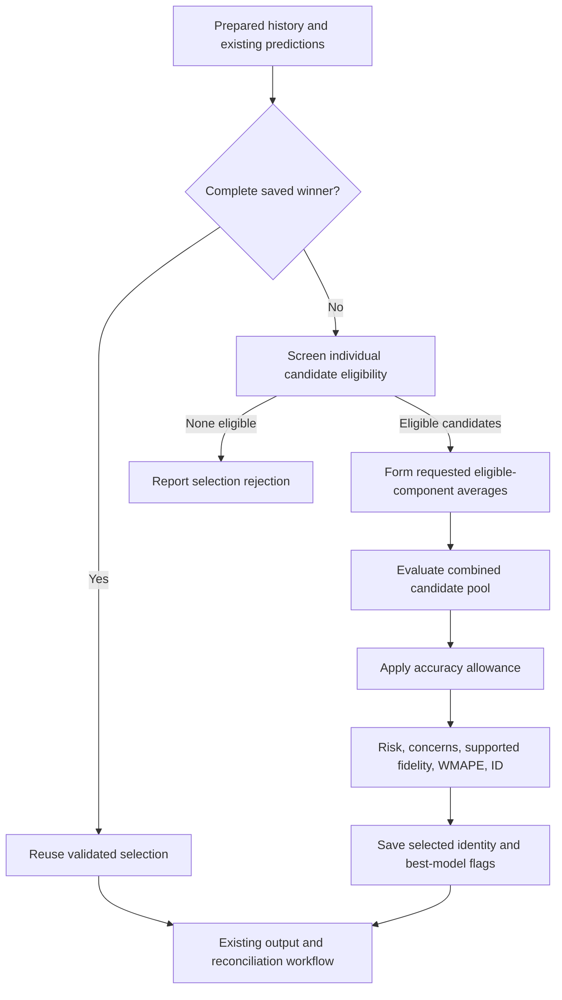

# FinnTS Architecture Map

Use this map to find the code that owns behavior. Confirm details in the implementation and tests before editing; this guide is navigation, not a substitute for source code.

## Standard Forecasting Flow

1. `R/run_info.R` creates and validates run configuration through `set_run_info()`.
2. `R/prep_data.R` prepares time-series data; shared input and combo validation lives in `R/input_checks.R`.
3. `R/prep_models.R` resolves model definitions, recipes, lags, and seasonal periods.
4. `R/train_models.R` fits enabled model workflows and coordinates feature selection.
5. `R/forecast_time_series.R` orchestrates the end-to-end standard forecast workflow.

Start with `tests/testthat/test-prep_data.R`, `tests/testthat/test-prep_models.R`, and `tests/testthat/test-forecast_time_series.R` for regression coverage near this flow.

`R/run_info.R` is also consumed by Agent workflows. Follow the Agent runtime rule when changing fields or defaults used by Agent reasoning, replay, or run comparison.

## Agent Forecasting Flow

1. `R/agent_info.R` creates Agent configuration and canonicalizes input identity through `set_agent_info()`.
2. `R/agent_iterate_forecast.R` defines forecast iteration, reasoning inputs, run comparison, graph construction, and finalization.
3. `R/agent_run.R` executes graph nodes and classifies retryable reasoning failures versus hard operational failures.
4. `R/agent_update_forecast.R` replays previous settings and handles compatibility with older runs.
5. `R/agent_eda.R`, `R/agent_summarize_models.R`, and `R/agent_ask.R` own their respective LLM-facing workflows.
6. `R/read_write_data.R` owns storage access used by the workflows; graph execution should not acquire new storage responsibilities.

High-value tests are `test-agent-chat-serialization.R`, `test-agent-duplicate-runs.R`, `test-agent-graceful-abort.R`, `test-agent-eda-summaries.R`, `test-finalize_run.R`, and `test-combo-normalization.R` under `tests/testthat/`.

## Model Selection

Use this map first to locate the owning workflow, then consult the [Best Model Selection vignette](../../vignettes/best-model-selection.Rmd) for thresholds, formulas, examples, and limitations. The [Agent iteration policy](../../.claude/rules/agent-runtime.md#iteration-selection-policy) is the maintenance contract; a documentation or performance change must not redefine it.

### Five Different Decisions

| Decision | Owner | What it decides |
| --- | --- | --- |
| Select a candidate within one run and series | `select_series_forecasts()` and `rank_forecast_candidates()` in [R/forecast_selection.R](../../R/forecast_selection.R) | Hard eligibility, then an accuracy shortlist, then future-risk ordering. Applies to individuals, learned ensembles, and requested simple averages. |
| Choose settings for the next Agent iteration | `load_run_results()` in [R/agent_iterate_forecast.R](../../R/agent_iterate_forecast.R), using `best_agent_iteration()` in [R/forecast_selection.R](../../R/forecast_selection.R) | Current-version chronological history, earliest minimum WMAPE, then later near-best iterations with a lower model-pool mean. Does not rescore old future forecasts. |
| Promote a saved Agent forecast | `log_selected_agent_run()` in [R/agent_iterate_forecast.R](../../R/agent_iterate_forecast.R) | Run-level promotion plus per-series protection of local winners. All remaining global winners must identify one global iteration. |
| Accept an updated saved choice | `update_forecast_combo()` in [R/agent_update_forecast.R](../../R/agent_update_forecast.R), using `assess_update_forecasts()` in [R/forecast_selection.R](../../R/forecast_selection.R) | Refit required saved components, assess the newly generated source paths, and retain that exact choice or route rejection to default-local recovery. |
| Produce a coherent hierarchy | `reconcile_hierarchical_data()` in [R/hierarchy.R](../../R/hierarchy.R), or `reconcile()` / `reconcile_agent_forecast()` in [R/agent_update_forecast.R](../../R/agent_update_forecast.R) | Reconcile selected source forecasts with the existing solver. No post-reconciliation future-quality ranking or model switch. |

The within-run allowance is `best_wmape + max(0.005, 0.05 * best_wmape)`, with WMAPE expressed as a fraction. The Agent's separate search-context window is 10% relative to its minimum-WMAPE iteration. Neither is a confidence interval. Update hyperparameter retuning also has an existing 10% accuracy-degradation trigger; it is not the iteration-context rule.

### Within-Run Call Path

The coordinating function is `final_models()` in [R/final_models.R](../../R/final_models.R). It owns average construction, saved flags, intervals, and output finalization. Learned ensembles are fitted earlier by [R/ensemble_models.R](../../R/ensemble_models.R); their inputs pass `screen_ensemble_inputs()` before fitting. The shared selector itself does not fit models or write artifacts.

Read [R/forecast_selection.R](../../R/forecast_selection.R) in these groups:

1. `read_series_history()` / `normalize_series_history()` recover original-scale actuals, prefer R1 or use R2's `Horizon == 1`, and retain only evidence at or before the cutoff. `Target_Original` takes precedence; transformation metadata restores its scale.
2. `prepare_forecast_evaluation()` fixes the expected scenario/date keys and shares one history-only reference across candidates. `forecast_reference()` chooses supported drift or the seasonal-naive/recent-median fallback; `forecast_trend_reference()` requires two chronological historical validation blocks. These references are checks, not replacement forecasts.
3. `evaluate_forecast_candidates()` separates hard failures from soft concerns. Missing/extra/duplicate keys, non-finite predictions, catastrophic magnitude, or unavailable accuracy make a candidate ineligible. Hard-eligible candidates receive level, trend, and supported seasonal checks.
4. `rank_forecast_candidates()` shortlists on WMAPE before `order_forecast_candidates()` compares risk, concern count, supported seasonal fidelity, WMAPE, and stable ID. Fidelity participates only when every candidate in the tied risk/concern tier has an assessed value. A soft concern alone does not disqualify an ordinary run's best available candidate.
5. `validate_forecast_selection()` checks the internal selector contract: exactly one ranking row per requested candidate and either an eligible `selected_id` or `NA`. No eligible winner leads to the existing typed selection-rejection path; storage/training errors are not converted into quality rejections.

**Use `selected_id`, not the first row of `rankings`.** The returned table includes all candidates, ordered for diagnostics, even those outside the accuracy shortlist. Its first row need not be the delivered winner. `Eligible` expresses hard validity; `Risk` is the maximum assessed soft score; `Violations` counts soft reasons; `Seasonal_Fidelity = NA` means unassessed, not perfect. A hard-rejected path can have zero risk because its soft checks were skipped.

### Identities And Accuracy

| Term | Meaning |
| --- | --- |
| `Combo` | One series identity, including a prepared hierarchy node when selection occurs before reconciliation. |
| `Model_ID` / `selected_id` | A candidate identity within that series/run. A simple-average ID preserves its exact component IDs; it does not mean every requested model. |
| `Best_Model = "Yes"` | The delivered candidate's flag. All individual flags can be `"No"` when a saved average wins. |
| `Best-Model` reconciled output | The coherent result of the selected mixture. Different source nodes can choose different models or averages. |
| `model_avg_wmape` | A search-direction statistic, not the accuracy of an averaged forecast. Local mean/median/standard deviation describe individual candidate WMAPEs, excluding simple-average forecasts. Existing global fields use overall run WMAPE for mean/median and zero spread. |

`forecast_backtest_accuracy()` matches original actuals to native prediction dates, retaining overlapping backtest observations. `agent_forecast_accuracy()` instead scores selected completed-output backtests for ordinary Agent goal and saved-winner decisions. With weekly-to-daily output these can differ because of zero-actual handling and rounding. `calculate_fcst_metrics()` carries `forecast_accuracy`, `model_accuracy`, and `selection_ok` attributes into logging without another artifact read. Update logging preserves its native aggregate through `aggregate_wmape`, while completed-output rows supply per-series and local model-pool statistics. Do not collapse these distinct metric contracts into one score.

### Agent Search And Persistence

`best_agent_iteration()` expects chronological rows. The earliest eligible minimum-WMAPE row anchors the 10% window; it does not repeatedly widen the window after choosing another row. Among later eligible rows inside that window, a strictly lower finite `model_avg_wmape` can advance the settings context. Earlier ties remain preferred. Partial/rejected or other-version results cannot win.

For example, adding an external regressor may improve multivariate models while ARIMA remains the winner. Lower model-pool error preserves that search direction. It does not promise future improvement or authorize overwriting a superior saved local forecast. `agent_model_accuracy()` and `record_agent_selection_attempt()` preserve those statistics and their distinct local/global meanings.

`log_selected_agent_run()` applies the run promotion decision before writing per-series records. Global rows move as one iteration-level choice, even when an individual series gets worse; superior local winners remain protected. `validate_global_iteration()` rejects mixed global `best_run_name` values on reload/finalization/update. Exact post-write verification detects mismatched records, but the per-series writes are not a transaction.

Ordinary accuracy-goal stopping uses complete, finite WMAPE without a second soft-quality veto. Search context, saved forecast, and stopping are separate decisions; changes to one must not silently alter the others.

### Restarts, Updates, And Artifacts

- `completed_forecast_selection()` checks combined saved winner content, expected keys, finite predictions, and exact saved-average arithmetic. It returns `NULL` for a reconstructable unfinished selection. Missing original average components require restoring artifacts rather than substituting a different combination.
- A complete saved winner is reused without new fitting or retrospective plausibility scoring. An unfinished selection is rebuilt from existing predictions. Weekly output is restored to native cadence, preserving invalid values from any expanded day. Reconciled-output reuse also validates content, not just filename existence or a completion log.
- An update is different: it generates new forecasts from the saved choice. `read_global_update_selection()` recovers per-series component mappings; `update_global_models()` refits only their required union from one global run. `assess_update_forecasts()` requires every component to be hard-eligible and the delivered choice to have no soft concerns, then preserves the saved identity rather than choosing a new runner-up.
- Retuning produces new predictions and therefore needs another acceptance check. Quality-rejected series enter the existing default-local replacement path separately from execution failures. A replacement must pass the stricter acceptance gate before reconciliation; no post-solver quality loop refits it again.
- `read_selection_file()` / `read_series_history()` use exact artifact paths and workflow-scoped caches. Logs are CSV even when forecast data uses another format. A genuinely missing optional average is allowed; authentication, storage, empty/corrupt required content, and deserialization failures must not masquerade as absence.
- Rankings/references remain in memory. Existing source predictions, average artifacts, selected flags, run logs, and best-run records carry the persisted evidence. Standard retrieval retains successfully reconciled per-model outputs plus the selected mixture; hierarchical Agent publication retrieves the selected mixture only.

### Tests To Read First

| Contract | Existing coverage |
| --- | --- |
| Original truth, eligibility, shortlist, averages, fidelity, exact history reads | [test-forecast-selection.R](../../tests/testthat/test-forecast-selection.R) |
| Historical drift support, units, seasonal alignment, reference caching | [test-forecast-selection-trend.R](../../tests/testthat/test-forecast-selection-trend.R) |
| Boundary cases, missing evidence, key completeness, deterministic ordering | [test-forecast-selection-corners.R](../../tests/testthat/test-forecast-selection-corners.R) |
| Saved-average arithmetic, combined flags, partial restarts, reconciliation repair | [test-final-models-restart.R](../../tests/testthat/test-final-models-restart.R) |
| Iteration context, local protection, one global iteration, rounded completed metrics, no repeated quality reads | [test-agent-selection-policy.R](../../tests/testthat/test-agent-selection-policy.R) and [test-load_run_results.R](../../tests/testthat/test-load_run_results.R) |
| Required update components, retained identities, native/completed metrics | [test-agent-update-selection.R](../../tests/testthat/test-agent-update-selection.R) |
| Pre-reconciliation selection, no post-solver switch, real solver behavior | [test-reconciled-forecast-selection.R](../../tests/testthat/test-reconciled-forecast-selection.R) |

Follow the [validation matrix](validation-matrix.md) for the touched boundary. Document new or modified helpers using the [function documentation contract](../../.claude/rules/r-package.md#function-documentation), and update this map when ownership changes. Keep detailed scoring formulas in the vignette rather than duplicating them in every caller.

## Multistep Models

`R/multistep_helper.R` contains shared horizon and training-data behavior. Model adapters live in `R/multistep_*.R`; their cross-frequency and daily regression coverage lives in `tests/testthat/test-multistep*.R`.

## Optional Features

- `R/optional_dependencies.R` centralizes optional-package checks and actionable errors.
- `R/feature_selection.R` owns `vip`, Boruta, ranger, and corrr feature-selection behavior.
- `R/agent_summarize_models.R` must degrade only variable-importance output when `vip` is unavailable.
- `R/timegpt_model.R` owns the optional `nixtlar` TimeGPT integration.
- `DESCRIPTION` and `.github/workflows/R-CMD-check.yaml` define supported package and CI dependency boundaries.

## Generated And Published Files

Roxygen comments in `R/` generate `NAMESPACE` and `man/*.Rd`. Pkgdown generates `docs/`. Edit sources and regenerate outputs; never hand-edit generated files.
