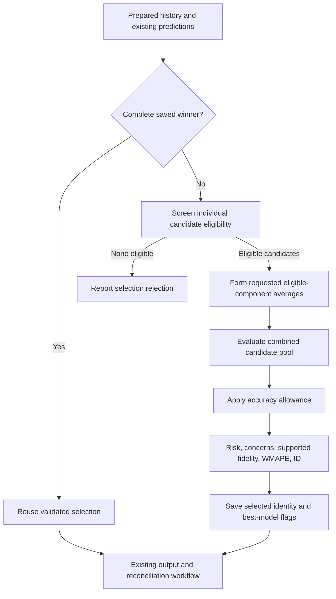

# FinnTS Architecture Map

Use this map to find the code that owns behavior. Confirm details in the implementation and tests before editing; this guide is navigation, not a substitute for source code.

## Standard Forecasting Flow

1. `R/run_info.R` creates and validates run configuration through `set_run_info()`.
2. `R/prep_data.R` prepares time-series data; shared input and combo validation lives in `R/input_checks.R`.
3. `R/prep_models.R` resolves model definitions, recipes, lags, and seasonal periods.
4. `R/train_models.R` fits enabled model workflows and coordinates feature selection.
5. `R/forecast_time_series.R` orchestrates the end-to-end standard forecast workflow.

Start with `tests/testthat/test-prep_data.R`, `tests/testthat/test-prep_models.R`, and `tests/testthat/test-forecast_time_series.R` for regression coverage near this flow.

`R/run_info.R` is also consumed by Agent workflows. Follow the Agent runtime rule when changing fields or defaults used by Agent reasoning, replay, or run comparison.

## Experimental Custom Runtime

- [R/custom_models.R](../../R/custom_models.R) owns passive definition validation and canonical identity. It never executes source or grants approval.
- [R/custom_model_engine.R](../../R/custom_model_engine.R) owns the internal `custom_model_workflow()` constructor, dormant `finnts_custom` parsnip registration, and technical fit/predict entrypoints. [R/utility.R](../../R/utility.R) registers the adapter during package loading without evaluating model source.
- [R/custom_model_registry.R](../../R/custom_model_registry.R) owns passive, version-pinned RDS records and candidate resolution. Registry artifacts use a reserved run token and full definition digest within the caller's project/root, independently of forecast run names and output formats. Exact-path reads reuse existing storage helpers without listings; present malformed records, including RDS `NULL`, cannot be mistaken for absence or overwritten. Sequential idempotence does not promise cross-provider transactions.
- The internal resolver preserves explicit `models_to_run` order and include-over-exclude precedence. `NULL` keeps built-in defaults; supplying definitions alone never enrolls them. It validates all entries, reads only selected references, and hashes sorted effective names and selected versions. Capabilities are declarations, not verified compatibility. Registry presence grants neither approval nor execution consent.
- Construction is inert. Fitting and prediction require `allow_code = TRUE` and a matching definition hash. Source functions use a private base-parented environment, analysis-fold data, explicit scalar representation context, and portable fitted state. These are trusted-code guardrails, not a sandbox or a user-approval service.
- Recipes must be unprepped and use supported predictor-only steps. Outcome and identity changes are rejected; baked factor `Combo` values are restored by label. The adapter neither transforms nor restores target scale. R1/R2 compatibility and requested horizons must be declared explicitly.
- Prediction source receives no `Target`. It returns `.finnts_row` and finite numeric `.pred`; the adapter validates exact row coverage and restores request order. Unknown series, unsupported dates, nonportable state and source failures raise errors rather than selecting another model.
- [R/custom_model_runs.R](../../R/custom_model_runs.R) owns experimental trusted-envelope consumption, profile checks, run manifests, custom version IDs and saved-artifact membership. `prep_models()` and `forecast_time_series()` accept `custom_models`; only explicit `models_to_run` enrolls them. `forecast_time_series()` exposes `stationary` with its existing TRUE default. Standard R1 local/global fits bypass tuning and retain exact definition versions without source regeneration. Custom failures propagate rather than becoming successful built-in fallbacks.
- The initial standard profile is original-scale R1 `bottoms_up` with local/mounted storage, RDS model objects and sequential/PSOCK execution. It rejects target cleaning/transforms, feature selection, clipping, learned ensembles, inner parallelism and unsupported backends before fitting. Full version-keyed custom IDs keep readable underscore-containing aliases out of average-component separators. All saved identities are checked before standard completion shortcuts; ranking policies remain unchanged.
- [R/custom_model_authoring.R](../../R/custom_model_authoring.R) owns `create_custom_model()`: isolated structured chat, fixed interpretation/examples, source generation, one `review_create` decision, bounded repairs and conditional approval. Compact console rendering accepts yes/no, details and edits without hash entry; explicit details exposes exact source and examples without execution. Structured requests disable inherited tools and receive approach-specific guidance; no raw real-series values are sent automatically. [R/custom_model_validation.R](../../R/custom_model_validation.R) retains deterministic sampling, read-only prepared-run access, direct current-session validation and measured evidence. Installed and `load_all()` callers use loaded functions without subprocesses or staging. Expected examples remain fixed during code repair, and changed candidates need fresh consent. The elapsed budget is checked after return; no interruption, crash isolation or sandbox is provided.
- [R/custom_model_drafts.R](../../R/custom_model_drafts.R) owns the schema-2 state machine, passive non-enrollable drafts, exact revision/request identities, cumulative budgets and abbreviated print summaries. Manual review uses a normalized affirmative receipt. Explicit automatic policy instead records a separate candidate/contract-bound authorization before every execution or repair, never a fabricated human response. Automatic mode cannot pause for clarification or change to/from manual on resume; missing legacy policy means manual. Successful validation returns the envelope without another gate; exact approved replay avoids provider calls/refits. Details/edits remain manual-only. Unfinished older three-gate drafts require a new call.
- `create_custom_model()` accepts only `approval = "manual"` (default) or `"automatic"`; explicit NULL/interactive/deferred values must migrate. `custom_author_defaults(version)` preserves catalog 1 and adds the percentage `growth_basis` fallback in catalog 2 for new automatic policies. `custom_author_request()` derives schema/guidance from the saved catalog; `validate_custom_model_draft()` and `custom_author_checks()` accept supported saved versions without migration or numerical-gate changes. Explicit absolute/percentage-point/CAGR choices override the fallback; no rate or calendar is invented. `custom_author_automatic_policy()` binds effective input settings and `custom_author_assumptions()` rejects unknown/default-overriding keys or widened modes/drivers. Semantic defaults-used declarations are provider evidence, not universal interpretation proof. Generated examples receive fixed 1e-8 tolerance before source generation; supplied or repair examples never change. Contract identity and validation JSON retain catalog/effective/default evidence. The [defaults table](../../vignettes/best-model-selection.Rmd#automatic-authorization) documents boundaries and never-default business choices.
- `custom_run_envelope()` retains strict legacy manual records and adds only the exact automatic shape (`intent_confirmed = FALSE`, `allow_code = TRUE`, `mode = "automatic"`, matching version). Standard manifests and passive Agent contracts already bind the complete approval/validation records. Policy changes do not change source/definition IDs; older FinnTS may reject automatic records. No numerical validation, engine, registry, hierarchy enrollment or forecasting-selection algorithm changes are part of automatic authoring.
- `custom_author_examples()` preserves the exact next-horizon date comparison and marks its rejection with `example_horizon`. `custom_author_contract_feedback()` maps allowlisted codes to bounded package-owned messages; unknown codes receive generic guidance, never raw exception/provider text. `custom_draft_drive()` persists the code in its existing diagnostic field, includes safe feedback in contract retries, and retains it in exhaustion errors without resetting budgets. Invalid supplied examples fail without replacement; only unaccepted generated examples may be regenerated. Accepted contracts and source-repair diagnostics remain fixed. Offline seasonal tests cover three-month prior-year times 1.11 examples, real holdouts/serialization, strict bad-date rejection, privacy and manual draft replay; no live-provider guarantee is claimed.
- Well-formed examples outside the contract's declared modes receive `example_mode`, separate from metadata/tolerance errors. Contract prompts require only declared modes, with global sample requirements conditional on global enrollment in the definition. The existing feedback mapper and unchanged draft driver carry the specific diagnostic through retries and exhaustion. No example filtering, relabeling or capability expansion occurs. Portable tests reproduce the captured local/global/local contradiction, preserve valid local/global/mixed controls and verify real local seasonal validation after provider correction.
- Authoring reliability uses `custom_author_source_preflight()` for passive named-call compatibility and `custom_author_failure()`/`validate_custom_author_failure()` for bounded phase/reason records. `custom_author_child()` catches candidate fit/predict errors locally while workflow and RDS I/O failures propagate. Worked-example comparisons are limited to four rows; real holdout data is excluded. `custom_author_source_message()` may expose only a short exact parsed constant `stop()` literal accepted by the privacy filter. Source repairs receive previous source/version plus the frozen contract and safe evidence, preserving parameter units and all acceptance checks.
- `custom_author_history_feedback()` derives minimum counts, per-scenario synthetic row counts and observed-lag feasibility from rejected declarations, without filling data or changing answers. `custom_author_dependency_candidates()` suggests export locations only from already-loaded eligible namespaces; it neither loads packages nor rewrites source. Automatic `business_clarification` stops retain bounded questions through the existing rejected-contract snapshot. Prompt guidance preserves Date lookup types and independently checkable arithmetic; these aids do not certify arbitrary prose or source semantics.
- `custom_draft_record()` maintains optional schema-2 diagnostics with at most 12 attempts and one source/contract snapshot under a one-MiB JSON cap; oversized snapshots retain hashes and omission markers. `validate_custom_draft_diagnostics()` rejects corrupted/nonpassive history; legacy drafts may omit it. Lifecycle errors carry a bounded `diagnostics` field and a local persisted-draft reference when available. Diagnostic history neither grants consent nor enables interrupted-action replay. The captured month/year bug and a real-fit multi-rule matrix are offline regression evidence, not live-provider qualification.
- Deferred authoring stores immutable local state revisions and a current pointer in a unique caller-selected or temporary directory, alongside a separate bounded data snapshot. Draft objects retain exact context references, not training data or sessions. Every resume verifies prepared-data/snapshot hashes, runtime metadata, execution contract, current revision, receipts and report identity. Old isolated-execution drafts require fresh review; approved envelopes remain reusable. Corrupt/interrupted state fails without repair; no transaction, authentication or exactly-once guarantee is claimed. Validation restores ordinary options, RNG, working directory and library paths, not arbitrary side effects. Options are restored literally because `do.call()` can evaluate language-valued settings.
- `custom_author_preflight()` validates all raw series before sampling/padding: common cadence-aligned finite history, explicit/shared inferred cutoff, and complete declared future drivers. Prepared driver inputs validate each exact artifact once and reuse the sampled reads; upstream imputation and driver vintages cannot be proven from stored data. `custom_author_checks()` records cutoff provenance and conditional driver-score caveats. The cutoff is validation evidence only; later fits derive their own cutoffs and reuse the approved definition without reauthoring. Pending drafts keep their original context.
- Authoring returns the existing passive envelope, not training data, chat state or a fitted workflow. Standard enrollment still constructs workflows from the exact definition. Model-catalog entries, custom tuning, R2 integration, Spark and remote standard execution remain deferred. Envelope evidence is trusted-caller attestation, not authenticated approval or a hosted-code sandbox.
- Explicit standalone hierarchy definitions use schema 2 with `requirements$hierarchy` binding one approach, `each_prepared_node` application and `finnts_reconciliation`. Schema-1 hashes and approvals remain unchanged. `custom_run_eligibility()` requires a shared explicitly mixed custom/FinnTS pool, independent of eventual winners; custom-only HTS errors without insertion or mode switching. Inert built-in workflow metadata checks dependency availability; foundation-model competitors remain unqualified for this profile.
- `custom_run_hierarchy_panel()` rejects incomplete finite historical panels before zero filling; `custom_run_hierarchy_context()` binds exact topology, leaf data and every R1 node artifact without directory discovery. Raw authoring retains all nodes from up to three sampled leaves, while prepared authoring captures all nodes under the same 10000-row cap. Intent review explicitly describes reconciliation adjustments, and measured holdouts must cover every captured node.
- [R/hierarchy.R](../../R/hierarchy.R) validates complete custom candidate/node/fold coverage before any reconciliation output, preserves readable aliases and propagates errors without legacy missing-node substitution or silent omission. Existing hts weighting and node-selection policies are unchanged. [R/final_models.R](../../R/final_models.R) enforces local/no-average/native-week controls and carries the validated enrollment into reconciliation and restart reuse. Agent hierarchy and per-series routing remain separate work.

- New calls freeze authoring protocol 4 through `custom_author_protocol()`. `package_policy` defaults to `installed_finnts`, with an explicit `base_only` alternative. Existing installed direct-dependency metadata is filtered through the canonical passive-definition boundary; no new allow-list, package installation or arbitrary/transitive-only eligibility is introduced.
- `custom_author_history_requirements()` canonicalizes bounded explicit row/lag declarations; `custom_author_check_history()` verifies each example series and forecast lookup date before contract acceptance. Requirements use captured cadence, not prose or parameter-name inference. Caller examples and accepted oracles are never extended or rewritten. Protocol-1/2/3 drafts retain their old schemas.
- `custom_author_source_bindings()` reuses lexical binding collection for conservative protocol-state checks before new-protocol source execution. It identifies obvious unbound fit/predict names without evaluating source/defaults, loading namespaces, injecting state, or treating quoted/formula/unknown NSE syntax as ordinary evaluation. `validate_custom_author_bindings()` bounds static repair evidence; the existing driver forwards it without changing retry or consent rules.
- `custom_author_example_type()` creates native nested ellmer schemas from the frozen scaffold and captured predictor types, using explicit property maps for dynamic names. Protocol 3 owns `missing_data = "error"` and replaces only generated `examples_json` with native `examples`; arbitrary passive parameter maps remain JSON with field-specific errors. Protocol-1/2 persisted drafts keep their original response schemas and source identity.
- `custom_author_contract_field()` restricts field labels to package vocabulary. `custom_draft_contract_rejection()` retains one whitelisted passive rejected proposal with a hash/code/field and omission flag under the existing one-MiB cap; `validate_custom_draft_contract_rejection()` rejects corruption. Protocol-3 unexpected validator errors stop rather than consuming LLM retries. Structured shape checks do not certify arithmetic; independent examples and real numerical gates remain required.
- `custom_author_source_guard()` derives actual qualified dependencies before candidate hashing, retains forbidden/private-call checks and rejects statically unresolved base callbacks or dynamic namespace APIs in the new protocol. `custom_author_namespace_check()` loads only selected namespaces and checks exports after consent, never during passive draft inspection. It is not a security sandbox or full static interpreter.
- `custom_author_assemble()` builds self-contained fit/predict source from provider bodies. New proposals may supply a sole complete function with exact ordered required formals and no defaults/ellipsis; parsing extracts that body once before hashing/consent. Canonical `assembled = TRUE` replay explicitly disables normalization and preserves historical source identities. Ambiguous wrappers/signatures produce `source_body_format` in the existing source-signature phase; no portability rule, protocol version or numerical oracle changes. Its separate calculation function prevents early returns from bypassing the fixed numeric-vector/row wrapper. `custom_author_example_scaffold()` and `custom_author_scaffold_examples()` own synthetic dates, keys, scenario coverage and tolerances; providers supply values and independent arithmetic. Caller examples and accepted oracles are never reconstructed from candidate execution.
- Protocol, package pool and scaffold are bound in new drafts/contracts and verified on replay. Legacy single-confirmation drafts retain complete source and declared-only packages. Engine, definition/envelope schemas, registry and forecast selection remain unchanged; forecast reuse needs neither authoring nor package rediscovery.
- Optional dependency diagnostics allow eight static references, 32 eligible names and eight KiB with omission counts. Strict validators and the existing driver carry exact reasons through source repairs and exhaustion. Namespace/export failures are repairable only under the new consented authoring path; unrelated workflow/RDS failures remain hard errors.

Start with [test-custom-model-contract.R](../../tests/testthat/test-custom-model-contract.R), [test-custom-model-runtime.R](../../tests/testthat/test-custom-model-runtime.R), and [test-custom-model-registry.R](../../tests/testthat/test-custom-model-registry.R). Registry transport tests are mocked, not live-backend verification. Fresh-process and PSOCK runtime tests must also run from an installed package namespace; development `load_all()` skips are not worker verification.

[test-custom-model-standard.R](../../tests/testthat/test-custom-model-standard.R) covers real standard forecasts, version-bound restarts, custom-only averages and installed training workers using explicitly synthetic approval fixtures. User-facing compatibility limits are in the [selection walkthrough](../../vignettes/best-model-selection.Rmd#experimental-custom-models).

[test-custom-model-authoring.R](../../tests/testthat/test-custom-model-authoring.R) covers offline structured replies, human gates and real same-session authoring followed by the staged standard forecast API. [test-custom-model-validation.R](../../tests/testthat/test-custom-model-validation.R) covers same-PID execution, no child/installation calls, fixed numerical examples, elapsed-budget checks and ordinary state restoration. Provider transport is mocked: these tests do not verify live generation quality. Installed end-to-end and fresh-session restart tests remain separate qualification of package loading, not authoring child execution.

[test-custom-model-drafts.R](../../tests/testthat/test-custom-model-drafts.R) adds serialized human-gate transitions, stale/duplicate replies, source repairs, unchanged prepared artifacts, context/evidence corruption, private print output and raw/prepared resumption in real installed processes. Deferred review does not broaden custom recipe/backend compatibility or update recovery. Those and final release qualification remain separate work packages.

[test-custom-model-hierarchy.R](../../tests/testthat/test-custom-model-hierarchy.R) covers mixed-pool-only eligibility, preserved schema-1 identity, real standard/grouped monthly forecasts and restarts, grouped two-worker parity, complete-coverage faults, native-cadence independent projection oracles and local RDS/Parquet context I/O. Installed authoring tests additionally validate raw/prepared hierarchy TEST/APPROVE resumption in fresh processes. Qualification limits are explicit in the [hierarchy evidence matrix](../../vignettes/hierarchical-forecasting.Rmd#reviewed-custom-rules); broader capability cells and timing/release gates remain open.

### Agent Candidate Contract

[R/agent_custom_models.R](../../R/agent_custom_models.R) owns the passive Agent contract and parent/child identity guards. `resolve_agent_custom_models()` binds explicitly selected approved envelopes, original-scale R1 constraints, required drivers and enabled local/global modes. Its contract identity includes version-bound evidence and canonical context; `validate_agent_custom_models()` rejects stale identities, altered profiles and changed derived membership without refreshing approval.

`agent_custom_candidates()` exposes only enrolled mode-compatible names and whitelisted descriptive metadata, using explicitly supplied foundation availability without credential lookup. `validate_agent_custom_proposal()` reuses existing Agent parsing and typed proposal errors, then enforces the pinned pool, required selected-custom drivers and fixed representation. Even a built-in-only subset of an active mixed contract must retain that representation. Invalid contract identities remain hard errors; missing proposal fields never receive built-in defaults.

`set_agent_info()` pins one exact parent-run RDS contract before publishing its CSV log. Coordinating entry reads restore and validate saved enrollment even when in-memory custom fields are removed. `iterate_forecast()` constrains mode routing, prompts and proposals; `submit_fcst_run()` forwards exact envelopes to the standard runtime. Graph arguments use a context reference so literal braces in approved metadata are not interpolated. EDA does not receive the custom contract. History, saved winners and summary publication verify parent/child identities without changing ranking policy.

Initial custom Agent execution supports local/mounted CSV data, RDS objects, sequential/local-machine execution and no inner parallelism. `summarize_models()` dispatches validated custom workflows to source-free generic summaries. [test-agent-custom-models.R](../../tests/testthat/test-agent-custom-models.R) covers passive contracts; [test-agent-custom-integration.R](../../tests/testthat/test-agent-custom-integration.R) covers real offline local/global/mixed forecasts, restart identity, summaries, unsupported-update guards and installed two-worker dispatch. Scripted Chat/EDA fixtures are not live-provider verification.

Custom `update_forecast()` requires explicit `allow_iterate_forecast = FALSE` and an identically enrolled new parent with unchanged cadence, horizon, regressors, modes and series. `prepare_agent_custom_update()` pins an exact parent `-agent-custom-update.rds` record and textual `custom_agent_update_id` before child fitting. It binds predecessor ownership, selected source components, current input signatures and replay controls. Reentry uses that predecessor without reselection. Missing required records, corruption and conflicting markers fail untouched; these writes are not transactional.

`initial_agent_custom_update()` supplies the existing graph's dispatch shape without its new-series/default route. `agent_custom_update_child()` verifies direct worker entry; `audit_agent_custom_update_result()` checks one shared fit union and per-series subsets before reuse or publication. `fit_models()` preserves approved custom specs/recipes and complete chronological fold predictions, while `adjust_forecast()` retains full version IDs before averaging. Mixed retuning reuses fixed custom results. Existing quality acceptance and selection policy are unchanged, but any custom replay failure or rejection is a hard error instead of recovery. EDA receives a contract-free copy through context references.

[test-agent-custom-updates.R](../../tests/testthat/test-agent-custom-updates.R) covers new-data arithmetic, local/global/chained replay, mixed selected subsets, provenance corruption, completed-output reuse and installed two-worker parity. It also protects both `finalize_run()` CSV rewrite branches against numeric-looking run hashes and leading-zero series. New-series handling, changed enrollment, automatic repair and implicit optimization remain outside custom replay.

## Agent Forecasting Flow

1. `R/agent_info.R` creates Agent configuration and canonicalizes input identity through `set_agent_info()`.
2. `R/agent_iterate_forecast.R` defines forecast iteration, reasoning inputs, run comparison, graph construction, and finalization.
3. `R/agent_run.R` executes graph nodes and classifies retryable reasoning failures versus hard operational failures.
4. `R/agent_update_forecast.R` replays previous settings and handles compatibility with older runs.
5. `R/agent_eda.R`, `R/agent_summarize_models.R`, and `R/agent_ask.R` own their respective LLM-facing workflows.
6. `R/read_write_data.R` owns storage access used by the workflows; graph execution should not acquire new storage responsibilities.

High-value tests are `test-agent-chat-serialization.R`, `test-agent-duplicate-runs.R`, `test-agent-graceful-abort.R`, `test-agent-eda-summaries.R`, `test-finalize_run.R`, and `test-combo-normalization.R` under `tests/testthat/`.

## Model Selection

Use this map first to locate the owning workflow, then consult the [Best Model Selection vignette](../../vignettes/best-model-selection.Rmd) for thresholds, formulas, examples, and limitations. The [Agent iteration policy](../../.claude/rules/agent-runtime.md#iteration-selection-policy) is the maintenance contract; a documentation or performance change must not redefine it.

### Five Different Decisions

| Decision | Owner | What it decides |
| --- | --- | --- |
| Select a candidate within one run and series | `select_series_forecasts()` and `rank_forecast_candidates()` in [R/forecast_selection.R](../../R/forecast_selection.R) | Hard eligibility, then an accuracy shortlist, then future-risk ordering. Applies to individuals, learned ensembles, and requested simple averages. |
| Choose settings for the next Agent iteration | `load_run_results()` in [R/agent_iterate_forecast.R](../../R/agent_iterate_forecast.R), using `best_agent_iteration()` in [R/forecast_selection.R](../../R/forecast_selection.R) | Current-version chronological history, earliest minimum WMAPE, then later near-best iterations with a lower model-pool mean. Does not rescore old future forecasts. |
| Promote a saved Agent forecast | `log_selected_agent_run()` in [R/agent_iterate_forecast.R](../../R/agent_iterate_forecast.R) | Run-level promotion plus per-series protection of local winners. All remaining global winners must identify one global iteration. |
| Accept an updated saved choice | `update_forecast_combo()` in [R/agent_update_forecast.R](../../R/agent_update_forecast.R), using `assess_update_forecasts()` in [R/forecast_selection.R](../../R/forecast_selection.R) | Refit required saved components, assess the newly generated source paths, and retain that exact choice or route rejection to default-local recovery. |
| Produce a coherent hierarchy | `reconcile_hierarchical_data()` in [R/hierarchy.R](../../R/hierarchy.R), or `reconcile()` / `reconcile_agent_forecast()` in [R/agent_update_forecast.R](../../R/agent_update_forecast.R) | Reconcile selected source forecasts with the existing solver. No post-reconciliation future-quality ranking or model switch. |

The within-run allowance is `best_wmape + max(0.005, 0.05 * best_wmape)`, with WMAPE expressed as a fraction. The Agent's separate search-context window is 10% relative to its minimum-WMAPE iteration. Neither is a confidence interval. Update hyperparameter retuning also has an existing 10% accuracy-degradation trigger; it is not the iteration-context rule.

### Within-Run Call Path

```mermaid
flowchart TD
	inputs[Prepared history and existing predictions] --> restart{Complete saved winner?}
	restart -->|Yes| reuse[Reuse validated selection]
	restart -->|No| screen[Screen individual candidate eligibility]
	screen -->|None eligible| rejected[Report selection rejection]
	screen -->|Eligible candidates| averages[Form requested eligible-component averages]
	averages --> evaluate[Evaluate combined candidate pool]
	evaluate --> shortlist[Apply accuracy allowance]
	shortlist --> rank[Risk, concerns, supported fidelity, WMAPE, ID]
	rank --> chosen[Save selected identity and best-model flags]
	reuse --> output[Existing output and reconciliation workflow]
	chosen --> output
```

The coordinating function is `final_models()` in [R/final_models.R](../../R/final_models.R). It owns average construction, saved flags, intervals, and output finalization. Learned ensembles are fitted earlier by [R/ensemble_models.R](../../R/ensemble_models.R); their inputs pass `screen_ensemble_inputs()` before fitting. The shared selector itself does not fit models or write artifacts.

Read [R/forecast_selection.R](../../R/forecast_selection.R) in these groups:

1. `read_series_history()` / `normalize_series_history()` recover original-scale actuals, prefer R1 or use R2's `Horizon == 1`, and retain only evidence at or before the cutoff. `Target_Original` takes precedence; transformation metadata restores its scale.
2. `prepare_forecast_evaluation()` fixes the expected scenario/date keys and shares one history-only reference across candidates. `forecast_reference()` chooses supported drift or the seasonal-naive/recent-median fallback; `forecast_trend_reference()` requires two chronological historical validation blocks. These references are checks, not replacement forecasts.
3. `evaluate_forecast_candidates()` separates hard failures from soft concerns. Missing/extra/duplicate keys, non-finite predictions, catastrophic magnitude, or unavailable accuracy make a candidate ineligible. Hard-eligible candidates receive level, trend, and supported seasonal checks.
4. `rank_forecast_candidates()` shortlists on WMAPE before `order_forecast_candidates()` compares risk, concern count, supported seasonal fidelity, WMAPE, and stable ID. Fidelity participates only when every candidate in the tied risk/concern tier has an assessed value. A soft concern alone does not disqualify an ordinary run's best available candidate.
5. `validate_forecast_selection()` checks the internal selector contract: exactly one ranking row per requested candidate and either an eligible `selected_id` or `NA`. No eligible winner leads to the existing typed selection-rejection path; storage/training errors are not converted into quality rejections.

**Use `selected_id`, not the first row of `rankings`.** The returned table includes all candidates, ordered for diagnostics, even those outside the accuracy shortlist. Its first row need not be the delivered winner. `Eligible` expresses hard validity; `Risk` is the maximum assessed soft score; `Violations` counts soft reasons; `Seasonal_Fidelity = NA` means unassessed, not perfect. A hard-rejected path can have zero risk because its soft checks were skipped.

### Identities And Accuracy

| Term | Meaning |
| --- | --- |
| `Combo` | One series identity, including a prepared hierarchy node when selection occurs before reconciliation. |
| `Model_ID` / `selected_id` | A candidate identity within that series/run. A simple-average ID preserves its exact component IDs; it does not mean every requested model. |
| `Best_Model = "Yes"` | The delivered candidate's flag. All individual flags can be `"No"` when a saved average wins. |
| `Best-Model` reconciled output | The coherent result of the selected mixture. Different source nodes can choose different models or averages. |
| `model_avg_wmape` | A search-direction statistic, not the accuracy of an averaged forecast. Local mean/median/standard deviation describe individual candidate WMAPEs, excluding simple-average forecasts. Existing global fields use overall run WMAPE for mean/median and zero spread. |

`forecast_backtest_accuracy()` matches original actuals to native prediction dates, retaining overlapping backtest observations. `agent_forecast_accuracy()` instead scores selected completed-output backtests for ordinary Agent goal and saved-winner decisions. With weekly-to-daily output these can differ because of zero-actual handling and rounding. `calculate_fcst_metrics()` carries `forecast_accuracy`, `model_accuracy`, and `selection_ok` attributes into logging without another artifact read. Update logging preserves its native aggregate through `aggregate_wmape`, while completed-output rows supply per-series and local model-pool statistics. Do not collapse these distinct metric contracts into one score.

### Agent Search And Persistence

`best_agent_iteration()` expects chronological rows. The earliest eligible minimum-WMAPE row anchors the 10% window; it does not repeatedly widen the window after choosing another row. Among later eligible rows inside that window, a strictly lower finite `model_avg_wmape` can advance the settings context. Earlier ties remain preferred. Partial/rejected or other-version results cannot win.

For example, adding an external regressor may improve multivariate models while ARIMA remains the winner. Lower model-pool error preserves that search direction. It does not promise future improvement or authorize overwriting a superior saved local forecast. `agent_model_accuracy()` and `record_agent_selection_attempt()` preserve those statistics and their distinct local/global meanings.

`log_selected_agent_run()` applies the run promotion decision before writing per-series records. Global rows move as one iteration-level choice, even when an individual series gets worse; superior local winners remain protected. `validate_global_iteration()` rejects mixed global `best_run_name` values on reload/finalization/update. Exact post-write verification detects mismatched records, but the per-series writes are not a transaction.

Ordinary accuracy-goal stopping uses complete, finite WMAPE without a second soft-quality veto. Search context, saved forecast, and stopping are separate decisions; changes to one must not silently alter the others.

### Restarts, Updates, And Artifacts

- `completed_forecast_selection()` checks combined saved winner content, expected keys, finite predictions, and exact saved-average arithmetic. It returns `NULL` for a reconstructable unfinished selection. Missing original average components require restoring artifacts rather than substituting a different combination.
- A complete saved winner is reused without new fitting or retrospective plausibility scoring. An unfinished selection is rebuilt from existing predictions. Weekly output is restored to native cadence, preserving invalid values from any expanded day. Reconciled-output reuse also validates content, not just filename existence or a completion log.
- An update is different: it generates new forecasts from the saved choice. `read_global_update_selection()` recovers per-series component mappings; `update_global_models()` refits only their required union from one global run. `assess_update_forecasts()` requires every component to be hard-eligible and the delivered choice to have no soft concerns, then preserves the saved identity rather than choosing a new runner-up.
- Retuning produces new predictions and therefore needs another acceptance check. Quality-rejected series enter the existing default-local replacement path separately from execution failures. A replacement must pass the stricter acceptance gate before reconciliation; no post-solver quality loop refits it again.
- `read_selection_file()` / `read_series_history()` use exact artifact paths and workflow-scoped caches. Logs are CSV even when forecast data uses another format. A genuinely missing optional average is allowed; authentication, storage, empty/corrupt required content, and deserialization failures must not masquerade as absence.
- Rankings/references remain in memory. Existing source predictions, average artifacts, selected flags, run logs, and best-run records carry the persisted evidence. Standard retrieval retains successfully reconciled per-model outputs plus the selected mixture; hierarchical Agent publication retrieves the selected mixture only.

### Tests To Read First

| Contract | Existing coverage |
| --- | --- |
| Original truth, eligibility, shortlist, averages, fidelity, exact history reads | [test-forecast-selection.R](../../tests/testthat/test-forecast-selection.R) |
| Historical drift support, units, seasonal alignment, reference caching | [test-forecast-selection-trend.R](../../tests/testthat/test-forecast-selection-trend.R) |
| Boundary cases, missing evidence, key completeness, deterministic ordering | [test-forecast-selection-corners.R](../../tests/testthat/test-forecast-selection-corners.R) |
| Saved-average arithmetic, combined flags, partial restarts, reconciliation repair | [test-final-models-restart.R](../../tests/testthat/test-final-models-restart.R) |
| Iteration context, local protection, one global iteration, rounded completed metrics, no repeated quality reads | [test-agent-selection-policy.R](../../tests/testthat/test-agent-selection-policy.R) and [test-load_run_results.R](../../tests/testthat/test-load_run_results.R) |
| Required update components, retained identities, native/completed metrics | [test-agent-update-selection.R](../../tests/testthat/test-agent-update-selection.R) |
| Pre-reconciliation selection, no post-solver switch, real solver behavior | [test-reconciled-forecast-selection.R](../../tests/testthat/test-reconciled-forecast-selection.R) |

Follow the [validation matrix](validation-matrix.md) for the touched boundary. Document new or modified helpers using the [function documentation contract](../../.claude/rules/r-package.md#function-documentation), and update this map when ownership changes. Keep detailed scoring formulas in the vignette rather than duplicating them in every caller.

## Multistep Models

`R/multistep_helper.R` contains shared horizon and training-data behavior. Model adapters live in `R/multistep_*.R`; their cross-frequency and daily regression coverage lives in `tests/testthat/test-multistep*.R`.

## Optional Features

- `R/optional_dependencies.R` centralizes optional-package checks and actionable errors.
- `R/feature_selection.R` owns `vip`, Boruta, ranger, and corrr feature-selection behavior.
- `R/agent_summarize_models.R` must degrade only variable-importance output when `vip` is unavailable.
- `R/timegpt_model.R` owns the optional `nixtlar` TimeGPT integration.
- `DESCRIPTION` and `.github/workflows/R-CMD-check.yaml` define supported package and CI dependency boundaries.

## Generated And Published Files

Roxygen comments in `R/` generate `NAMESPACE` and `man/*.Rd`. Pkgdown generates `docs/`. Edit sources and regenerate outputs; never hand-edit generated files.
