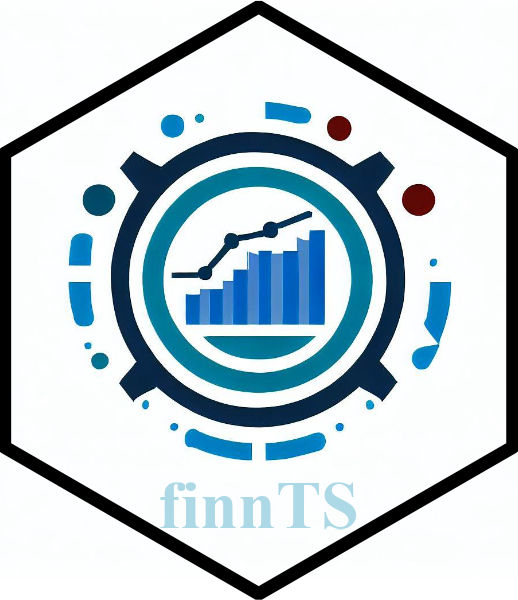

# Microsoft Finance Time Series Forecasting Framework



<!-- badges: start -->

[](https://cran.r-project.org/package=finnts)

<!-- badges: end -->

The Microsoft Finance Time Series Forecasting Framework, aka finnts or Finn, is an automated forecasting framework for producing financial forecasts. While it was built for corporate finance activities, it can easily expand to any time series forecasting problem!

-   Automated feature engineering, feature selection, back testing, and model selection.
-   Access to 25+ models. Both univariate and multivariate models.
-   Azure integration to run thousands of time series in parallel within the cloud.
-   Supports daily, weekly, monthly, quarterly, and yearly forecasts.
-   Handles external regressors, either purely historical or historical+future values.

## Installation

### CRAN version

``` r
install.packages("finnts")
```

### Development version

To get a bug fix or to use a feature from the development version, you can install the development version of finnts from GitHub.

``` r
# install.packages("devtools")
devtools::install_github("microsoft/finnts")
```

## Usage

``` r
library(finnts)

# prepare historical data
hist_data <- timetk::m4_monthly %>%
  dplyr::rename(Date = date) %>%
  dplyr::mutate(id = as.character(id))

# call main finnts modeling function
finn_output <- forecast_time_series(
  input_data = hist_data,
  combo_variables = c("id"),
  target_variable = "value",
  date_type = "month",
  forecast_horizon = 3,
  back_test_scenarios = 6, 
  models_to_run = c("arima", "ets"), 
  run_global_models = FALSE, 
  run_model_parallel = FALSE
)
```

## Contributing

This project welcomes contributions and suggestions. Most contributions require you to agree to a Contributor License Agreement (CLA) declaring that you have the right to, and actually do, grant us the rights to use your contribution. For details, visit <https://cla.opensource.microsoft.com>.

When you submit a pull request, a CLA bot will automatically determine whether you need to provide a CLA and decorate the PR appropriately (e.g., status check, comment). Simply follow the instructions provided by the bot. You will only need to do this once across all repos using our CLA.

This project has adopted the [Microsoft Open Source Code of Conduct](https://opensource.microsoft.com/codeofconduct/). For more information see the [Code of Conduct FAQ](https://opensource.microsoft.com/codeofconduct/faq/) or contact [opencode\@microsoft.com](mailto:opencode@microsoft.com) with any additional questions or comments.

## Trademarks

This project may contain trademarks or logos for projects, products, or services. Authorized use of Microsoft trademarks or logos is subject to and must follow [Microsoft's Trademark & Brand Guidelines](https://www.microsoft.com/en-us/legal/intellectualproperty/trademarks). Use of Microsoft trademarks or logos in modified versions of this project must not cause confusion or imply Microsoft sponsorship. Any use of third-party trademarks or logos are subject to those third-party's policies.
